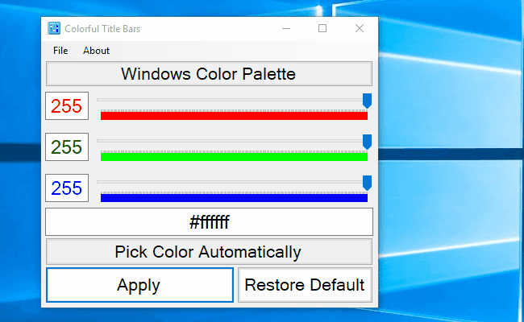

- [Colorful Title Bars](#colorful-title-bars)
  * [Features](#features)
  * [Requirements](#requirements)
  * [Notes](#notes)
  * [Download](#download)
  * [Technical Stuff and Third-Party Libraries](#technical-stuff-and-third-party-libraries)
  * [Demo](#demo)

# Colorful Title Bars

__Colorful Title Bars is a portable Windows 10 desktop tool that lets you easily modify the accent color of inactive title bars.__ Windows 10 personalization UI only includes the color customization of active title bars, leaving inactive window bars white. A counterintuitive Windows registry modification is required in order to modify the inactive accent color — and this tool does all the magic for you. Colorful Title Bars includes an easy to use color picker; alternatively you can let the application pick the color automatically based on your current accent color.

## Features

* __No installation required!__
* Easy to use integrated RGB sliders!
* Precisely adjust individual RGB values or even copy-and-paste entire hex strings!
* Import current accent colors directly from your system registry!
* Import and export .reg files with accent color values and run them natively on other Windows 10 computers!

### Supported Languages
* English (default, embedded in the .exe file)
* Polish

## Requirements

 * __Windows 10__
 * .NET Framework __4.6__

## Notes

* This application modifies certain Windows registry keys under __`[HKEY_CURRENT_USER\SOFTWARE\Microsoft\Windows\DWM]`__. It will not brick your computer or leave any ill side-effects!
* In order to see applied changes, color prevalence must be enabled in Windows personalization settings. The application will detect if color prevalence is disabled and will ask you for permission to enable it.
* __You will have to refocus the application window in order to see the changes (see the [Demo](#demo) below).__
* Exported .reg files do not modify/enable color prevalence, so it must be enabled manually in Windows personalization settings if .reg files are ran directly.
* The application is portable; the .exe file can be copied and ran on its own on any Windows computer. Language defaults to English if you do not copy localization directories with it. 
* And finally, if you are interested in helping translate this application, feel free to open an issue and contact me.

## Download

For download, visit the release page.

## Technical Stuff and Third-Party Libraries

Written in C# using Windows Forms. Shout-out to:
* System.IO.Abstractions and its TestingHelpers (https://github.com/System-IO-Abstractions/System.IO.Abstractions) used for unit tests for file system abstraction and mocking.
* ColorMine (https://libraries.io/github/THEjoezack/ColorMine) for certain color transformations.
* Fody and Costura (https://github.com/Fody/Costura) for embedding the aforementioned assemblies into the final product for portability.

## Demo

